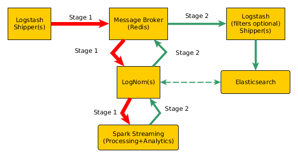

[](https://travis-ci.org/RedisLabs/spark-redis)

# LogNom
Provides wicked fast and scalable streaming log nomming via Apache Spark.
Spark is useful for simple processing and filtering distributed tasks to
complex data analysis.

data -> message broker -> Apache Spark nomming -> message broker -> elasticsearch




## Minimal requirements
 - Apache Spark v1.4.1 (provided by maven)
 Using a local cluster for now.
 If you want to use an external Spark cluster (I didn't test this yet):
 ```
 docker run -it --rm --volume "$(pwd)":/lognom -p 8088:8088 -p 8042:8042 -p 4040:4040 --name spark --hostname sandbox sequenceiq/spark:1.4.1 bash
 ```
 - Scala v2.11.8 (provided by maven)
 - Jedis v2.7 (provided by maven)
 - spark-redis (packaged internally)
 - Redis v3.2.1 (external)
 ```
 docker run --rm --name redis-logs redis
 ```
 
## Starting it
Clean and build packages:
```
 mvn clean package -DskipTests 
``` 
Start it up:
```
 mvn exec:java -Dexec.mainClass="org.squishyspace.lognom.LogNom"
```